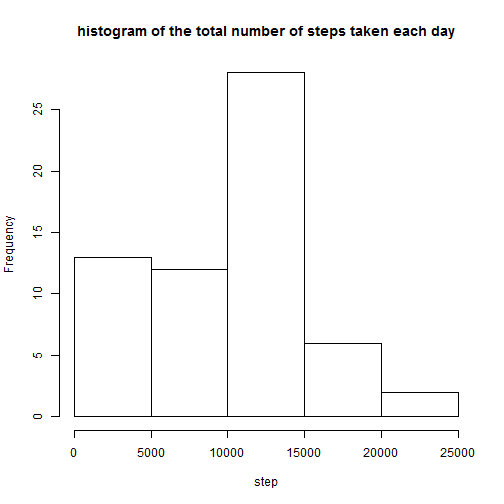
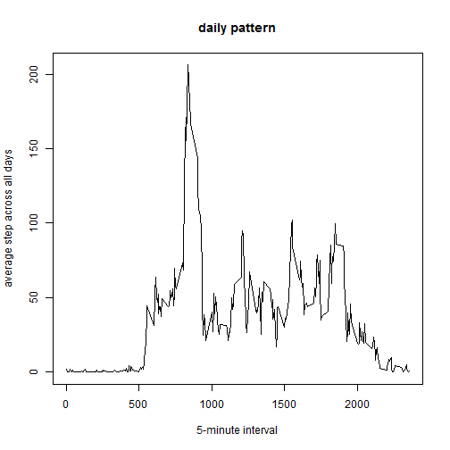
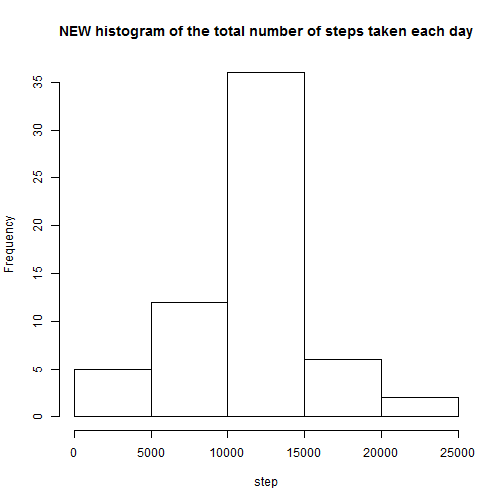
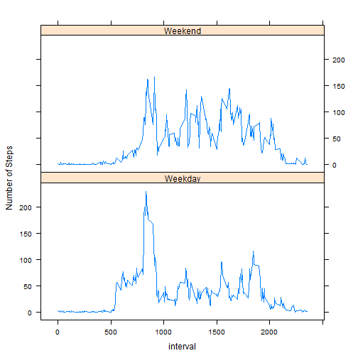

```r
data<-read.csv("C:/Users/weibinkelvin/Documents/activity.csv")
library(plyr)
library(dplyr)
```

```
## 
## Attaching package: 'dplyr'
## 
## The following objects are masked from 'package:plyr':
## 
##     arrange, count, desc, failwith, id, mutate, rename, summarise,
##     summarize
## 
## The following object is masked from 'package:stats':
## 
##     filter
## 
## The following objects are masked from 'package:base':
## 
##     intersect, setdiff, setequal, union
```

```r
GroupByDate<-group_by(data, date)
SummariseByDate<-summarise(GroupByDate, sum(steps, na.rm=TRUE))
names(SummariseByDate)<-c("date", "steps")
hist(SummariseByDate$steps, main="histogram of the total number of steps taken each day", xlab="step")
```

 

```r
mean(SummariseByDate$steps)
```

```
## [1] 9354.23
```

```r
median(SummariseByDate$steps)
```

```
## [1] 10395
```


```r
GroupByInterval<-group_by(data,interval)
SummariseByInterval<-summarise(GroupByInterval, mean(steps,na.rm=TRUE))
names(SummariseByInterval)<-c("interval", "Average_steps")
plot(SummariseByInterval$interval, SummariseByInterval$Average_steps, type="l", xlab="5-minute interval", main="daily pattern", ylab="average step across all days")
```

 

```r
maxIndex<-which.max(SummariseByInterval$Average_steps)
SummariseByInterval[maxIndex,]$interval
```

```
## [1] 835
```

```r
##835=8.35am
```


```r
sum(is.na(data))
```

```
## [1] 2304
```

```r
#number of rows with NA values
IntervalMean<-aggregate(steps~interval, data, mean, na.action=na.omit)$steps
newdata<-transform(data, steps=ifelse(is.na(data$steps),IntervalMean, data$steps))
```


```r
NewGroupByDate<-group_by(newdata, date)
NewSummariseByDate<-summarise(NewGroupByDate, sum(steps, na.rm=TRUE))
names(NewSummariseByDate)<-c("date", "steps")
hist(NewSummariseByDate$steps, main="NEW histogram of the total number of steps taken each day", xlab="step")
```

 

```r
mean(NewSummariseByDate$steps)
```

```
## [1] 10766.19
```

```r
median(NewSummariseByDate$steps)
```

```
## [1] 10766.19
```
Mean of old data is the same as the mean of new imputed data
However median of the 2 sets have changed. new data is higher than older one.


```r
copydata<-newdata
copydata$weekdays<-as.factor(weekdays(as.Date(newdata$date)))
copydata$ifweekday<-ifelse(!(copydata$weekday %in% c("Saturday","Sunday")), TRUE, FALSE)
weekday<-copydata[copydata$ifweekday,]
weekend<-copydata[!copydata$ifweekday,]

WeekdayMean <- aggregate(weekday$steps, by=list(interval=weekday$interval), FUN=mean)
WeekendMean <- aggregate(weekend$steps, by=list(interval=weekend$interval), FUN=mean)
colnames(WeekdayMean) <- c("interval", "average_steps")
colnames(WeekendMean) <- c("interval", "average_steps")
WeekdayMean$day <- "Weekday"
WeekendMean$day <- "Weekend"
CombineData<-rbind(WeekdayMean,WeekendMean)

library(lattice)
xyplot(average_steps ~  interval | day, data = CombineData, layout = c(1,2), type ="l", ylab="Number of Steps")
```

 
